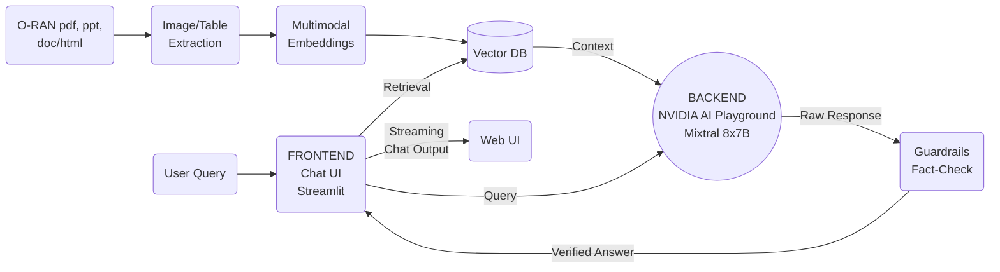

# Multimodal O-RAN RAG Chatbot with NVIDIA AI Foundation Endpoints or NVIDIA NIM for LLMs


This repository is designed to make it extremely easy to set up your own retrieval-augmented generation chatbot for ORAN techncial specifications and processes. The backend here calls the NVIDIA AI Foundation Endpoints, which makes it very easy to deploy on a thin client or Virtual Machine. This example is also compatible with NVIDIA NIM for LLMs if you wish to self-host these microservices on your GPU.

# Implemented Features
- [RAG in 5 minutes Chatbot Video](https://youtu.be/N_OOfkEWcOk) Setup with NVIDIA AI Foundation Endpoints
- This bot uses augmented retrieval methods like augmented query, query rewriting, cross encoder reranking and others.
- Source references with options to download the source document
- Analytics through Streamlit at ```/?analytics=on```
- Added user feedback and integrated with Google Sheets or other database
- Fact-check verification of results through a second LLM API call
- Multimodal parsing of documents - images, tables, text through multimodal LLM APIs
- Added simple conversational history with memory and summarization
- Support for NVIDIA NIM for LLMs

# Setup O-RAN RAG Chatbot

Before running the pipeline, please ensure that you have the following prerequisites:
- Python version 3.10.12
- GPU-enabled machine
- For NVIDIA AI Foundation Endpoints:
  - NVIDIA API Key
  - If you do not have a NVIDIA API Key, please follow the steps 1-4 mentioned [here](https://docs.nvidia.com/nim/large-language-models/latest/getting-started.html#ngc-authentication) to get your key.

- (Optional) For NVIDIA NIM for LLMs and NeMo Retriever Embedding Microservice:
  - [NVIDIA NIM for LLMs](hhttps://docs.nvidia.com/nim/large-language-models/latest/introduction.html) with Llama3-8B-instruct or Llama3-70B-instruct
  - [NeMo Retriever Text Embedding NIM](https://www.nvidia.com/en-us/ai-data-science/products/nemo/)
  - GPU resources to support the model(s) deployed on, please see the [support maxtix](https://docs.nvidia.com/nim/large-language-models/latest/support-matrix.html) for more details.

The following describes how you can have this chatbot up-and-running in less than 5 minutes.

### Step 1: Create and activate python virtual environment
   ```
   pip install virtualenv 	## if you don't already have virtualenv installed
   python3 -m virtualenv oranbot
   source oranbot/bin/activate
   ```
### Step 2. Clone this repository to a Linux machine

   ```
   git clone https://github.com/NVIDIA/GenerativeAIExamples.git && cd GenerativeAIExamples/community/oran-chatbot-multimodal
   ```

### Step 3. Install the requirements
   Goto the root of the oran_chatbot repository, and install the requirements in the virtual environment.
   ```
   pip install -r requirements.txt
   ```

### Step 4. Setup PowerPoint parsing
If you want to use the PowerPoint parsing feature, you will need LibreOffice. On Ubuntu Linux systems, use the following command to install it.
   ```
   sudo apt install libreoffice
   ```

### Step 5. (Optional) Setup Feedback feature
If you would like to use the "Feedback" feature, you will need a service account for Google Sheets.
Save your service account credentials file as `service.json` inside the `oran-chatbot-multimodel` folder.

### Step 6. Setup your NVIDIA API key

   To access NeMo services and language model, we will add the NVIDIA API key to the `config.yaml` file under the placeholder called `nvidia_api_key`. Note that the NVIDIA API key should be of form `nvapi-b**************`


### Step 7. (Optional) Enable NVIDIA NIM, NREM, or OpenAI-compatible LLM endpoint

**NVIDIA NIM / NREM (self-hosted):**
NVIDIA NIM for LLMs and NeMo Retriever Text Embeddings Microservice can be enabled in `config.yaml` if you wish to use these microservices instead of NVIDIA AI Foundation Endpoints.

To use self-hosted NIM, set `NIM: true` in `config.yaml` - then set `nim_model_name`, `nim_base_url`, and other parameters appropriately.

To use self-hosted NREM: set `NREM: true` in `config.yaml` - then set `nrem_model_name` and `nrem_api_endpoint_url` appropriately.

For more information on how to setup NIM, please see the documentation [here](https://docs.nvidia.com/nim/large-language-models/latest/getting-started.html).

**OpenAI-compatible endpoint (highest priority):**
Set `OPENAI: true` to use any OpenAI-compatible LLM service — including OpenAI, Azure OpenAI, vLLM, Ollama, or a private gateway such as [SynaXG AIHub](https://aihub.synaxg.com):

```yaml
OPENAI: true
openai_api_key: "your-key-here"
openai_model_name: "gpt-4o-mini"          # or model name from your gateway
openai_base_url: "https://your-endpoint/v1"   # leave empty for OpenAI
```

Discover available model names from your gateway:
```bash
curl https://your-endpoint/v1/models -H "Authorization: Bearer <your-key>"
```

**Local embeddings (no API key required):**
Set `local_embedding_model: "sentence-transformers/all-MiniLM-L6-v2"` (already enabled by default) to use a local HuggingFace model for embeddings when neither NREM nor NVIDIA API embeddings are available. Set it to `""` to fall back to the NVIDIA API embedding endpoint.

### Step 8. Run the chatbot

**Quick deploy (recommended):**
```bash
cd community/oran-chatbot-multimodal
chmod +x deploy.sh
./deploy.sh
# Custom port: ./deploy.sh --port 8080
```
`deploy.sh` creates the Python venv, installs all dependencies, validates `config.yaml`, and starts Streamlit automatically.

**Manual run:**
```bash
.venv/bin/python -m streamlit run Multimodal_Assistant.py --server.port 8011
```

The server is accessible at `http://localhost:8011`. On a remote machine, forward the port:
```bash
ssh -L 8011:localhost:8011 user@remote-host
```

### Step 9. Adding documents and creating vector database

   Before you can run the chatbot, we need to upload our documents to the bot and create a vector database.

   The official O-RAN documentations are available [here](https://www.o-ran.org/specifications).

   To upload these documents to O-RAN bot, you can use either of the following method:
   - Using streamlit UI, you can navigate to the `Knowledge Base` tab. Select the files using the `Browse Files` button and click on `Upload!` button.
   - Alternatively, you can upload the documents through the backend using following steps:

      - Make a directory named `oran` inside the vectorstore folder using command
      ```mkdir vectorstore/oran```
      - Move your O-RAN documents inside this folder using `cp /path/to/oran_document /vectorstore/oran`, or `cp /path/to/oran_folder/* /vectorstore/oran`. If you are running the bot through a remote server, you can use `scp` to upload the documents from your local machine to the server.

   Once the documents are uploaded, click on the `Create vector DB` button. This indexes all the uploaded documents into a vector database.

   You are all set now! Try out queries pertinent to the knowledge base using text from the UI.

   #### Add or delete documents from knowledge base

   All the documents in the knowledge base are shown in the drop-down menu of `Knowledge Base` tab.

   If you want to add more documents to your existing knowledge base, select the files using the `Browse Files` button in the `Knowledge Base` tab and click on `Upload!` button. Finally, click on the `Re-train Multimodal ORAN Assistant' button to complete the ingestion process.

   You can delete files from your knowledge base using the `Delete File` button. The default password to delete files is `oranpwd`, and can be changed using the `config.yaml` file.


### Step 10. Evaluating the chatbot

   Once our chatbot is running, we can use the evaluation scripts to test its performance.
   The `Run synthetic data generation` button in `Evaluation Metrics` tab generates a test dataset using the files in knowledge base. Once the synthetic test set is generated, click on the `Generate evaluation metrics` button to see a comprehensive evaluation report for the RAG performance.

## Architecture

### System Overview

```
User Query (Streamlit UI)
       │
       ▼
┌──────────────────────────────────────────────────────┐
│               Multimodal_Assistant.py                │
│  (Main Streamlit app — orchestration layer)          │
└───┬──────────────┬──────────────┬────────────────────┘
    │              │              │
    ▼              ▼              ▼
[RAG Pipeline] [Memory]      [Guardrails]
```

#### High-level data flow:


### RAG type options

Pass `--rag_type <N>` to select the retrieval pipeline:

| `--rag_type` | Pipeline |
|---|---|
| `0` | Basic RAG |
| `1` | *(recommended)* Augmented query + CrossEncoder reranking |
| `2` | HyDE + Reranker |
| `3` | MultiQueryRetriever + Reranker |


### End-to-End Query Flow (RAG type 1)

```
User Query
   │
   ├─► query_rewriting()         [if follow-up, uses ConversationSummaryMemory]
   │
   ├─► augment_multiple_query()  → 5 ORAN-specific sub-queries
   │
   ├─► get_relevant_docs()       × 6 (original + 5 augmented)  →  top-k docs
   │
   ├─► CrossEncoder reranking    →  top-4 docs
   │
   ├─► nemo_rag()                →  LLM streams answer to UI
   │
   ├─► add_history_to_memory()   →  update ConversationSummaryMemory
   │
   └─► fact_check()  [optional]  →  TRUE / FALSE verification
```

## Stopping and Restarting the Server

### Find the running process

```bash
pgrep -a -f streamlit
```

### Stop

```bash
# Replace <PID> with the PID printed by pgrep above
kill <PID>
```

### Restart (foreground — logs printed to terminal)

```bash
cd /path/to/oran-chatbot-multimodal
source .venv/bin/activate    # or use .venv/bin/python directly
streamlit run Multimodal_Assistant.py --server.port 8011 -- --rag_type 1
```

### Restart (background — persists after terminal close)

```bash
cd /path/to/oran-chatbot-multimodal
nohup .venv/bin/python -m streamlit run Multimodal_Assistant.py \
  --server.port 8011 \
  --server.headless true \
  --server.address 0.0.0.0 \
  -- --rag_type 1 \
  > /tmp/oran-chatbot.log 2>&1 &
echo "Started PID $!"
```

Tail the log at any time:

```bash
tail -f /tmp/oran-chatbot.log
```


### Verify the server is healthy

```bash
curl http://localhost:8011/_stcore/health   # → ok
```

## Component Swapping

All components are designed to be swappable, meaning that it should be easy to replace with something more complex. Here are some options for the same (this repository may not support these, but we can point you to resources if it is something that would be useful for you):

### Frontend
The current implementation of the chatbot uses Streamlit, which makes it very easy to interact with via a WebUI. However, it requires direct access to the machine via the port on which it is streaming.

### Retrieval
This uses the NVIDIA NeMo Retriever model through NVIDIA AI Playground. This is a fine-tuned version of the E5-large-v2 embedding model, and it is commercially viable for use. This maps every user query into a 1024-dim embedding and uses cosine similarity to provide relevant matches. This can be swapped out for various types of retrieval models that can map to different sorts of embeddings, depending on the use case. They can also be fine-tuned further for the specific data being used.

### Vector DB
The vector database being used here is FAISS, a CPU-based embedding database. It can easily be swapped out for numerous other options like ChromaDB, Pinecone, Milvus and others. Some of the options are listed on the [LangChain docs here](https://python.langchain.com/docs/integrations/vectorstores/).

### Prompt Augmentation
Depending on the backend and model, you may need to modify the way in which you format your prompt and chat conversations to interact with the model. The current design considers each query independently. However, if you put the input as a set of user/assistant/user interactions, you can combine multi-turn conversations. This may also require periodic summarization of past context to ensure the chat does not exceed the context length of the model.

### Backend
- Cloud Hosted: The current implementation uses the NVIDIA AI Foundation Endpoints to abstract away the details of the infrastructure through a simple API call. You can also swap this out quickly by deploying in DGX Cloud with NVIDIA GPUs and LLMs.
- On-Prem/Locally Hosted: If you would like to run a similar model locally, it is usually necessary to have significantly powerful hardware (Llama2-70B requires over 100GB of GPU memory) and various optimization toolkits to run inference (TRT-LLM and TensorRT). Smaller models (Llama2-7B, Mistral-7B, etc) are easier to run but may have worse performance.

### Configuration — `config.yaml`

| Key | Default | Description |
|---|---|---|
| `nvidia_api_key` | — | NVIDIA API key (`nvapi-…`) |
| `llm_model` | `mistralai/mixtral-8x7b-instruct-v0.1` | LLM for chat and guardrails |
| `embedding_model` | `nvidia/nv-embedqa-e5-v5` | NVIDIA API embedding model |
| `reranker_model` | `cross-encoder/ms-marco-MiniLM-L-6-v2` | Local CrossEncoder reranker |
| `local_embedding_model` | `sentence-transformers/all-MiniLM-L6-v2` | Local HuggingFace embedder (used when `NREM: false`; set to `""` to fall back to NVIDIA API) |
| `NIM` | `false` | Use self-hosted LLM NIM |
| `nim_model_name` | `meta/llama3-8b-instruct` | NIM model name |
| `nim_base_url` | `http://localhost:8000/v1` | NIM endpoint |
| `NREM` | `false` | Use self-hosted embedding NIM |
| `Reranker_NIM` | `false` | Use NVIDIARerank NIM instead of local CrossEncoder |
| `OPENAI` | `false` | Use any OpenAI-compatible LLM endpoint (highest priority when `true`) |
| `openai_api_key` | `sk-placeholder` | API key for the OpenAI-compatible service |
| `openai_model_name` | `gpt-4o-mini` | Model name as returned by the service's `/v1/models` endpoint |
| `openai_base_url` | `""` | Base URL (e.g. `https://aihub.synaxg.com/v1`); leave empty for OpenAI |
| `openai_api_version` | `""` | Required only for Azure OpenAI; leave empty otherwise |


## Directory Structure

```
oran-chatbot-multimodal/
├── Multimodal_Assistant.py      # Main Streamlit app (orchestration)
├── config.yaml                  # Runtime configuration
├── requirements.txt
├── bot_config/                  # System prompt / footer templates
├── docs/                        # Design documentation & smoke tests
├── evals/                       # Evaluation notebooks
├── guardrails/
│   └── fact_check.py            # Post-response LLM fact verification
├── llm/
│   ├── llm.py                   # LLM backend factory (NVIDIA / NIM / Local)
│   └── llm_client.py            # Unified text + multimodal client
├── pages/
│   ├── 1_Knowledge_Base.py      # Document upload / vector DB management
│   └── 2_Evaluation_Metrics.py  # Synthetic test set + RAG metrics
├── retriever/
│   ├── embedder.py              # Embedding models (NVIDIA / HuggingFace / NREM)
│   ├── retriever.py             # Retrieval functions (basic + multi-query)
│   └── vector.py                # Vector DB abstraction (Milvus / Qdrant)
├── utils/
│   ├── feedback.py              # Google Sheets feedback integration
│   └── memory.py                # ConversationSummaryMemory helpers
└── vectorstore/
    ├── custom_pdf_parser.py     # Multimodal PDF parsing (text/table/image)
    ├── custom_powerpoint_parser.py
    ├── embedder.py              # Ingestion-time embedder
    └── vectorstore_updater.py   # Add / delete documents from FAISS index
```

## Pipeline Enhancement Opportunities:

### Multimodal Parsing:
Upgrade the current PyMuPDF-based PDF parsing with a more sophisticated parser for improved extraction of images and tables. Employ a high-quality Multimodal Language Model (MLLM) to enhance image descriptions and implement structured data analysis techniques like text2sql or text2pandas for efficient table summarization.

### Evaluation Complexity:
Evaluating multimodal RAG pipelines is intricate due to the independence of each modality (text, images, tables). For complex queries requiring information synthesis across modalities, refining response quality becomes a challenging task. Aim for a comprehensive evaluation approach that captures the intricacies of multimodal interactions.

### Guardrails Implementation:
Implementing robust guardrails for multimodal systems presents unique challenges. Explore the introduction of guardrails for both input and output, tailored to each modality. Identify and address potential vulnerabilities by developing innovative red-teaming methodologies and jailbreak detection mechanisms to enhance overall security and reliability.

### Function-calling Agents:
Empower the Language Model (LLM) by providing access to external APIs. This integration allows the model to augment response quality through structured interactions with existing systems and software, such as leveraging Google Search for enhanced depth and accuracy in replies.

### Multi-Domain Bot Type Support:
The current deployment uses a single default database (`vectorstore/oran/`) and a fixed bot configuration (`multimodal_oran`). A natural enhancement is to restore the bot-type selector and wire each configuration to its own vectorstore folder — for example, `vectorstore/oran/` for O-RAN specs and `vectorstore/3gpp/` for 3GPP protocol documents. This would allow:

- **Separate ingestion pipelines** per domain, with different chunking strategies or parsers suited to each document type
- **Domain-targeted retrieval** — queries routed only to the relevant corpus, reducing context noise
- **Distinct LLM personas** per domain via different `header` system prompts in each `bot_config/*.config`
- **Cross-domain queries** could be supported by a router agent that fans out to both vectorstores and merges results before reranking

To implement: add a new config file (e.g. `bot_config/3gpp.config`) with `"core_docs_directory_name": "3gpp"`, restore the `st.selectbox` in `pages/1_Knowledge_Base.py` and `Multimodal_Assistant.py`, and upload documents into the corresponding folder via the Knowledge Base tab.
